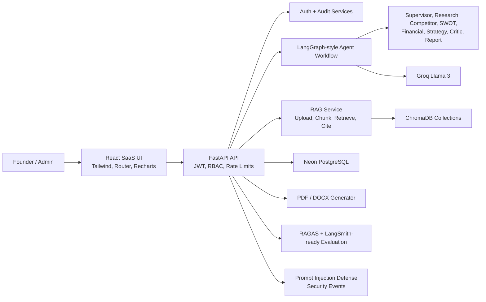

# Architecture

## Clean Architecture

- `app/api`: HTTP boundaries and RBAC dependencies.
- `app/services`: business logic for agents, RAG, reports, audit, security, evaluation, and LLM calls.
- `app/models.py`: SQLAlchemy persistence model.
- `app/schemas.py`: request/response DTOs.
- `database/schema.sql`: production PostgreSQL schema.
- `frontend/src/api.js`: API client and token session management.
- `frontend/src/App.jsx`: route-level SaaS experience.

## Data Flow

1. User authenticates with JWT.
2. User submits an analysis mode and business query.
3. Security service validates prompt-injection markers.
4. RAG service rewrites the query and retrieves relevant chunks with citation metadata.
5. Supervisor plans the workflow.
6. Specialist agents produce market, competitor, SWOT, financial, and GTM sections.
7. Critic validates contradictions and unsupported claims.
8. Report agent assembles scorecards, citations, and final viability score.
9. Report, agent logs, history, audit logs, and evaluation metrics are stored.
10. User downloads PDF/DOCX or reviews reports in the dashboard.

## Knowledge Base Collections

- Market Reports
- Industry Reports
- Competitor Profiles
- Startup Case Studies
- Business Frameworks
- Pricing Models
- SWOT Templates

## Security

- JWT authentication and role checks on protected routes.
- Admin-only routes for user management, evaluation, security, and logs.
- Rate limiting via SlowAPI.
- Prompt-injection marker detection with security-event logging.
- Environment variables for secrets.
- Sensitive value masking utility for logs and events.
